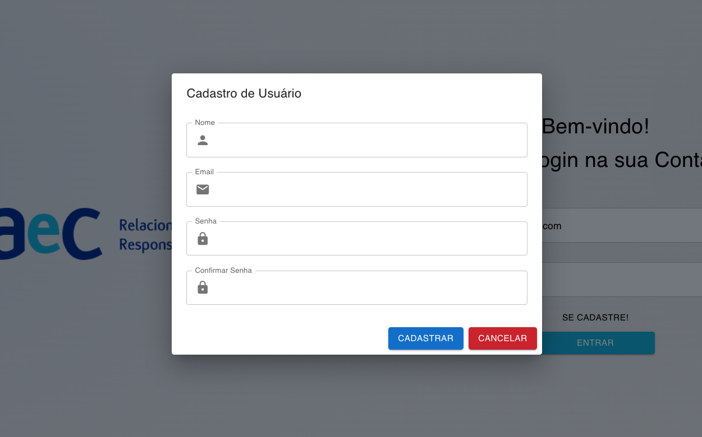
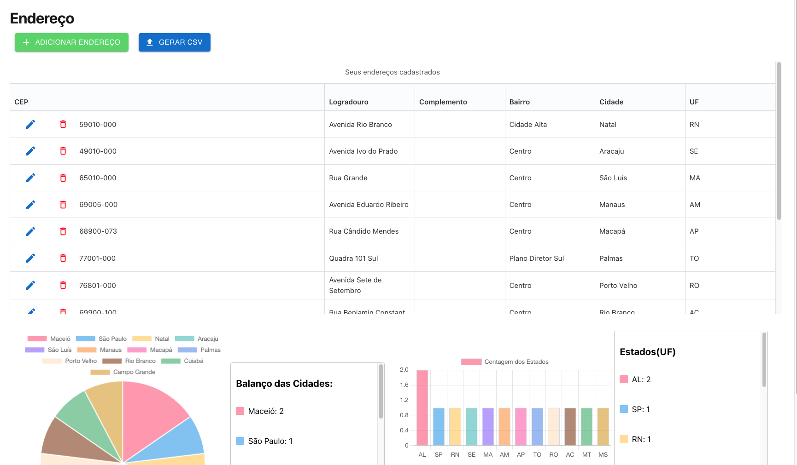
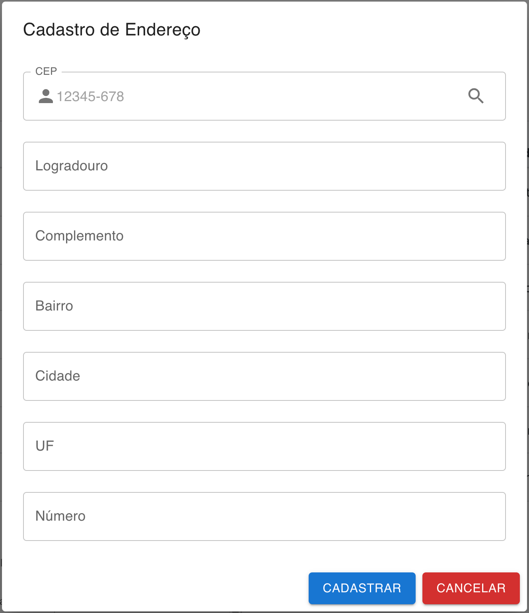
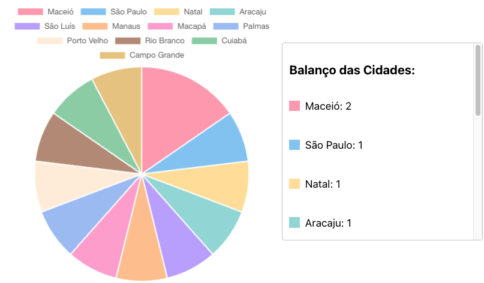
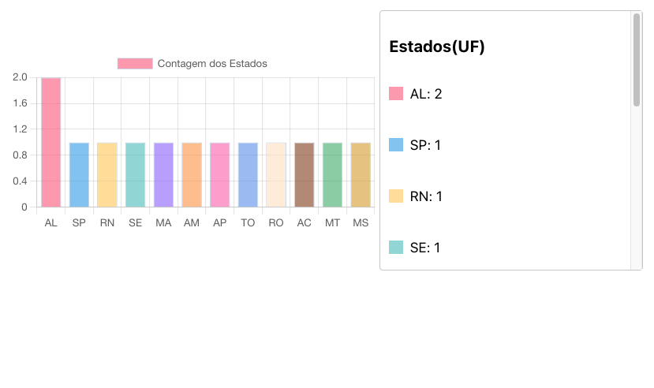
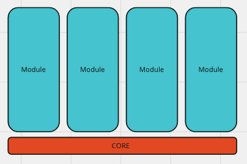
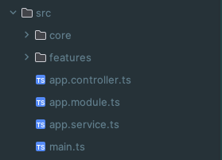

# Desafio AeC Backend - Documentação completa do Projeto - por Filipe Raposo
O desafio consiste em fazer um CRUD de gerência de endereços. Este é um guia prático sobre a aplicação.
  1. Guia para Instalar e Rodar o projeto localmente
  2. Telas e Funcionalidades
  3. Backend e Arquitetura


  [Visite a Documentacao dos Endpoints](https://aecdesafio.apidocumentation.com) <br>
  [Como rodar e demostrando o projeto](https://youtu.be/6BtPyS0E5s4)
## Rodando o Backend

```bash
$ cd server
$ npm i 
$ npm run start

# popular Banco de Dados com usuarios(opcional)
$ npm run populatewUsers

# popular Banco de Dados com Enderecos(opcional)
$ npm run populatewAddresses

```


Para rodar o Server localmente voce precisa adicionar um arquivo .ENV com esses
atributos:
```env
JWT_SECRET= SEU SEGREDO JWT
DB_HOST='127.0.0.1'
DB_USER=postgres
DB_PASSWORD= SUA SENHA 
DB_NAME= NOME DO SEU BANCO
PORT=5432
```
Para registrar as tabelas no banco, coloque 'synchronize: true', set synchronize para false novamente apos registrar as tabelas no banco: <br>
📂 Core  <br>
&nbsp;&nbsp;&nbsp;&nbsp;📂Data <br>
&nbsp;&nbsp;&nbsp;&nbsp;&nbsp;&nbsp;&nbsp;&nbsp;&nbsp;<a href="https://emoji.gg/emoji/8584-typescript"></a> data.providers.ts<br>

```
import { DataSource } from 'typeorm';
import * as process from 'process';
import * as dotenv from 'dotenv';

dotenv.config();
export const databaseProviders = [
  {
    provide: 'DATA_SOURCE',
    useFactory: async () => {
      const dataSource = new DataSource({
        type: 'postgres',
        port: 5432,
        host: process.env.DB_HOST,
        username: process.env.DB_USER,
        password: process.env.DB_PASSWORD,
        database: process.env.DB_NAME,
        entities: [__dirname + '/../**/*.entity{.ts,.js}'],
        synchronize: false, ## TROQUE POR 'TRUE' APENAS NA PRIMEIRA VEZ QUE RODAR O SERVIDOR
      });
      return dataSource.initialize();
    },
  },
];

```

## Rodando o Frontend

```bash
$ cd client
$ npm i 
$ npm run start
```
         

# Telas e Funcionalidades👇🏻
## Tela de Login.
<p align="center">
  
</p>

***
<br>

## Ao clicar em 'Se Cadastre:'
<p align="center">
  
</p>

***
<br>

## Dashboard Inicial
<p align="center">
  
</p>

    💡 Ao clicar no botão azul 'Gerar CSV', o usuário faz o download do
    arquivo em formato .csv referente à tabela de endereços cadastrados.

***
<br>

## Ao clicar no botão verde 'Adicionar novo endereço'
<p align="center">
  
</p>

    💡 Digite um CEP válido e clique na lupa para preencher os campos 
    automaticamente usando a API https://viacep.com.br/

***
<br>

## Visualizando Gráfico de Setores - Cidades
<p align="center">
  
</p>

    💡 Nesse gráfico o usuário tem uma visualização simplificada das cidades
    mais frequentes na tabela. 

***
<br>


## Visualizando Gráfico de Barras - Estados
<p align="center">
  
</p>

    💡 Nesse gráfico o usuário tem uma visualização simplificada dos estados
    mais frequentes na tabela. 
<br>

# Arquitetura do Backend e Conceitos Técnicos👇🏻

## Arquitetura
A arquitetura do backend foi baseada em duas arquiteturas comuns, Clean Architecture e Modules Architecture. Essa combinação é usada em projetos mais robustos, engloba todas as propriedades importantes de uma arquitetura MVC, por exemplo, mas resolve alguns problemas da Model-View-Controller.

A arquitetura base do projeto define os módulos como entidades não relacionadas, e todos os conteúdos e funcionalidades integradas estão na base/core

<h4>Representacao Visual<h4/>

<h4>Representacao Pratica<h4/>


### Core
É a camada responsável por conter as dependências do projeto, middlewares, serviços compartilhados, utilitários…

📂 Core  <br>
&nbsp;&nbsp;&nbsp;&nbsp;📂Data <br>
&nbsp;&nbsp;&nbsp;&nbsp;📂Domain <br>
&nbsp;&nbsp;&nbsp;&nbsp;📂Infra

       📂Data:  Contem a declaracao das entidades do banco de dados 
                suas relacoes com outras tabelas, caracteristica das 
                colunas. Modularizacao e configuracao do TYPEORM. 
***

      📂Domain:  temos tudo o que pertence ao nosso domínio, funcionalidades
      globais da aplicacao, nesse caso declarei a classe de CustomResponse
      essa classe define uma resposta constumizada e padronizada que se 
      comunica com o lado do cliente e estritamente todas as requisicoes
      devolvem uma CustomResponse(statusCode, message, data)

***

      📂Infra:  Na Infra, temos tudo o que dita a infraestrutura 
      do projeto middlewares, configurações… Nesse caso como o projeto
      eh simples, essa camada apresenta o middleware de autenticacao JWT
      entao toda a validacao relacionada a tokenizacao acontece nesse 
      middlewares, alem de que toda rota protegida deve passar por ele 
      para autenticar o usuario.

### Features(modules)
É a camada responsável por conter os modulos, cada modulo contem um controller, um
service e um modulo.


📂 features  <br>
&nbsp;&nbsp;&nbsp;&nbsp;📂address <br>
&nbsp;&nbsp;&nbsp;&nbsp;&nbsp;&nbsp;&nbsp;&nbsp;📂dtos <br>
&nbsp;&nbsp;&nbsp;&nbsp;&nbsp;&nbsp;&nbsp;&nbsp;📂pipes <br>
&nbsp;&nbsp;&nbsp;&nbsp;&nbsp;&nbsp;&nbsp;&nbsp;&nbsp;<a href="https://emoji.gg/emoji/8584-typescript"></a> address.controller.ts <br>
&nbsp;&nbsp;&nbsp;&nbsp;&nbsp;&nbsp;&nbsp;&nbsp;&nbsp;<a href="https://emoji.gg/emoji/8584-typescript"></a> address.module.ts<br>
&nbsp;&nbsp;&nbsp;&nbsp;&nbsp;&nbsp;&nbsp;&nbsp;&nbsp;<a href="https://emoji.gg/emoji/8584-typescript"></a> address.service.ts
<br>
&nbsp;&nbsp;&nbsp;&nbsp;&nbsp; 📂users <br>
&nbsp;&nbsp;&nbsp;&nbsp;&nbsp;&nbsp;&nbsp;&nbsp;📂dtos <br>
&nbsp;&nbsp;&nbsp;&nbsp;&nbsp;&nbsp;&nbsp;&nbsp;📂pipes <br>
&nbsp;&nbsp;&nbsp;&nbsp;&nbsp;&nbsp;&nbsp;&nbsp;&nbsp;<a href="https://emoji.gg/emoji/8584-typescript"></a> users.controller.ts <br>
&nbsp;&nbsp;&nbsp;&nbsp;&nbsp;&nbsp;&nbsp;&nbsp;&nbsp;<a href="https://emoji.gg/emoji/8584-typescript"></a> users.module.ts<br>
&nbsp;&nbsp;&nbsp;&nbsp;&nbsp;&nbsp;&nbsp;&nbsp;&nbsp;<a href="https://emoji.gg/emoji/8584-typescript"></a> users.service.ts


       💡 Controller:  Responsável por lidar com as requisições HTTP, 
                       definindo endpoints e mapeando rotas. Processa 
                       entradas do usuário, chama serviços para a
                       lógica de negócios e retorna respostas.
***

      💡 Module:  Define quem devem ser os controllers, services, 
                  providers,rotas protegidas por middleware. Estrutura a 
                  aplicação de forma modular, facilitando a manutenção 
                  e escalabilidade.

***

      💡 Service: Contém a lógica de negócios. Unica 
         camada que acessa o banco de dados e manipula 
         de fato os dados. 


