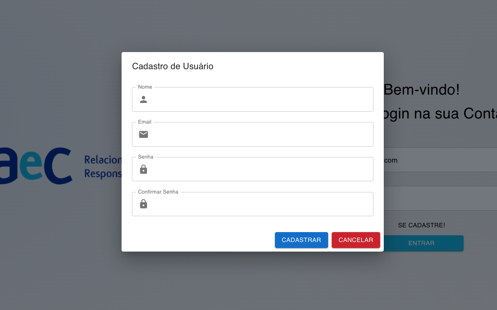
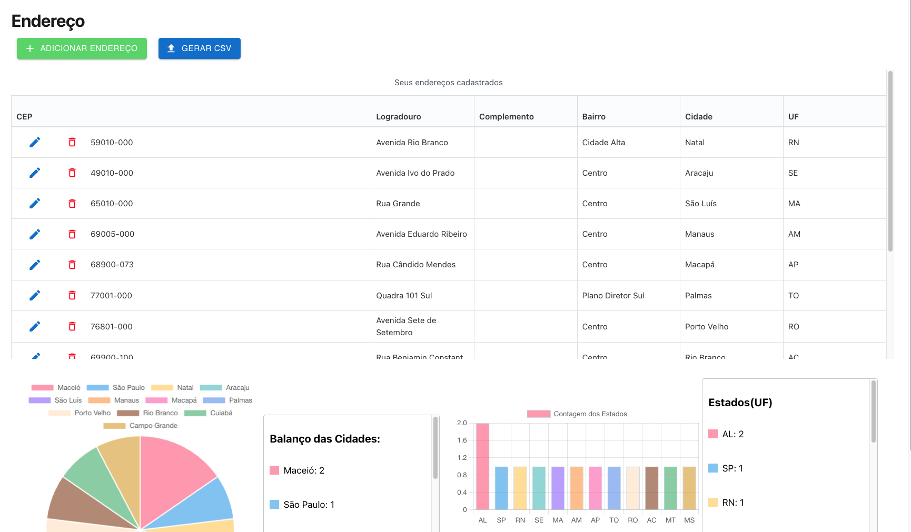
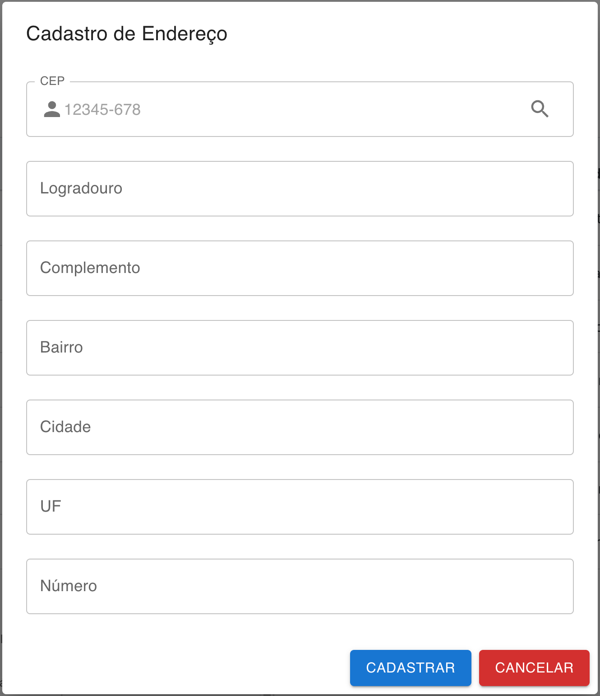
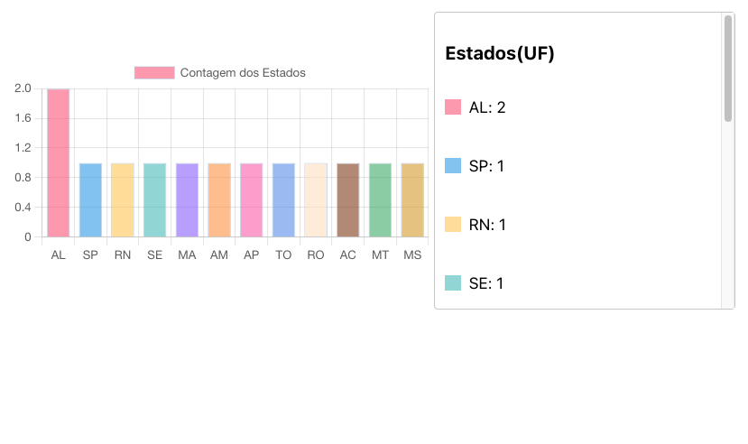

# Desafio AeC 
O desafio consistem em fazer um CRUD de gerência de endereços, Esse é um guia prático sobre a aplicação.
-  Primeira parte: Telas e funcionalidades.
-  Segunda parte:  Especificacoes tecnicas do Backend.

          Documentacao da API    =   link

# Telas e Funcionalidades👇🏻
> Tela de Login.

  

***
 

> Ao clicar em 'Se Cadastre:'

  

***
 

> Dashboard Inicial

  

    💡 Ao clicar no Botao Azul 'Gerar CSV', o usuario daz o Download do
    arquivo em formato .csv referente a tabela de enderecos cadastrados.

***
 

> Ao clicar no botao verde 'Adicionar novo endereco'

  

    💡 Digite um CEP valido e clique na Lupa para preencher os campos 
    automaticamente usando a API https://viacep.com.br/

***
 

> Vizualizando Grafico de Setores - Cidades 

  

    💡 Nesse grafico o usuario tem uma vizualizacao simplificada das cidades
    mais frequentes na tabela. 

***
 

> Vizualizando Grafico de Barras - Estados

  

    💡 Nesse grafico o usuario tem uma vizualizacao simplificada dos estados
    mais frequentes na tabela. 

# Arquitetura do Backend e Conceitos Tecnicos👇🏻
